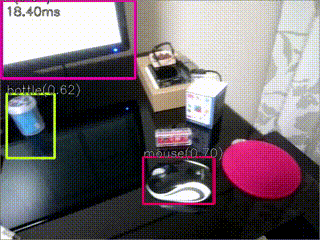
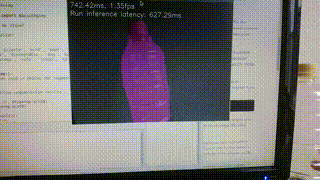
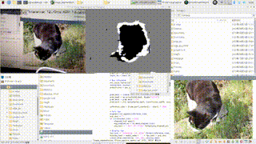

# TensorFlow Lite, Coral Edge TPU samples.

## About
TensorFlow Lite, Coral Edge TPU samples (Python/C++, Raspberry Pi/Windows/Linux).

## List of samples.

| Name | Language | Description | API | OS |
|:---|:---|:---|:---|:---|
|[Camouflage](camouflage)| Python | Object detection and camouflage objects by PiCamera. | PyCoral | Linux (Raspberry Pi) |
|[Classify](classify) | Python | Image classifilcation by PiCamera or Video Capture.| TF-Lite PyCoral | Linux Windows |
| [DeepLab](deeplab) | Python C++ | Semantic Segmentation using DeepLab v3. | TF-Lite EdgeTPU API | Linux Windows |
| [Object detection](detection) | Python C++ VC++ | Object detection by PiCamera or Video Capture. | TF-Lite PyCoral | Linux Windows |
| [U-Net MobileNet v2](segmentation) | Python | Image segmentation model U-Net MobileNet v2. | TF-Lite | Linux Windows 
| [Super resolution](super_resolution) | Python | Super resolution using ESRGAN. | TF-Lite | Linux Windows |

## Images

## Environment
- Coral Edge TPU USB Accelerator
- Raspberry Pi (3 B+ / 4) + PiCamera or UVC Camera
- x64 PC(Windows or Linux) + Video file or UVC Camera
- Python3

## Installation
- OpenCV with OpenCV's extra modules(3.4.5 or higher)
- TensorFlow Lite Runtime [(Python quickstart)](https://www.tensorflow.org/lite/guide/python).
- Edge TPU Python library [(Get started with the USB Accelerator)](https://coral.withgoogle.com/tutorials/accelerator/).

## Reference
- [Get started with the USB Accelerator](https://coral.withgoogle.com/tutorials/accelerator/)
- [TensorFlow models on the Edge TPU](https://coral.withgoogle.com/tutorials/edgetpu-models-intro/#model-requirements)
- [Models Built for the Edge TPU](https://coral.withgoogle.com/models/)
