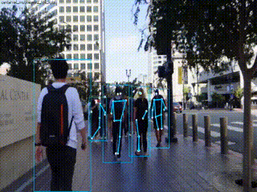
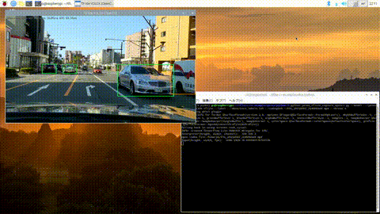

# TensorFlow Lite samples.

## About
TensorFlow Lite samples (Python/C++, Raspberry Pi/VisionFive 2/Windows/Linux).
 - CPU(XNNPACK) inference
 - Coral Edge TPU Delegate
 - GPU Delegate 

## List of samples.

| Name | Language | Description | API | OS |
|:---|:---|:---|:---|:---|
|[Camouflage](camouflage)| Python | Object detection and camouflage objects by PiCamera. | PyCoral | Linux Windows |
|[Classify](classify) | Python | Image classifilcation by PiCamera or Video Capture.| TF-Lite PyCoral | Linux Windows |
|[CenterNet](centernet)|Python C++|CenterNet on-device with TensorFlow Lite.|TF-Lite|Liux Windows|
| [DeepLab](deeplab) | Python C++ | Semantic Segmentation using DeepLab v3. | TF-Lite EdgeTPU API | Linux Windows |
| [Object detection](detection) | Python C++ VC++ | Object detection by PiCamera or Video Capture. | TF-Lite PyCoral | Linux Windows |
| [U-Net MobileNet v2](segmentation) | Python | Image segmentation model U-Net MobileNet v2. | TF-Lite | Linux Windows 
| [Super resolution](super_resolution) | Python | Super resolution using ESRGAN. | TF-Lite | Linux Windows |
| [YOLOX](yolox/python) | Python | YOLOX with TensorFlow Lite. | TF-Lite | Linux Windows |
| [DeepLab V3+ EdgeTPUV2 and AutoSeg EdgeTPU](deeplab_edgetpu2) | Python | DeepLab V3+ EdgeTPUV2 and AutoSeg EdgeTPU with TensorFlow Lite. | TF-Lite EdgeTPU | Linux Windows |
| [FFNet ](ffnet) | C++ | VisionFive 2 TensorFlow Lite GPU Delegate FFNet | TF-Lite GPU delegate | Linux |

## Images

|Object detection|Camouflage|DeepLab|
|:--:|:--:|:--:|
||||

|Segmentation|CenterNet|YOLOX|
|:--:|:--:|:--:|
||||

|DeepLab V3+ EdgeTPUV2 and AutoSeg EdgeTPU| VisionFive 2 TensorFlow Lite GPU Delegate FFNet46NS CCC Mobile Pre-Down Fused-Argmax | VisionFive 2 TensorFlow Lite GPU Delegate EfficientDet-Lite0 |
|:--:|:--:|:--:|
|YouTube Link |YouTube Link |YouTube Link |

## Environment
- Coral Edge TPU USB Accelerator
- Raspberry Pi (3 B+ / 4) + PiCamera or UVC Camera
- Dev Board
- VisionFive 2
- x64 PC(Windows or Linux) + Video file or UVC Camera
- Python3

## Installation
- OpenCV with OpenCV's extra modules(3.4.5 or higher)
- TensorFlow Lite Runtime [(Python quickstart)](https://www.tensorflow.org/lite/guide/python).
- Edge TPU Python library [(Get started with the USB Accelerator)](https://coral.withgoogle.com/tutorials/accelerator/).

## Reference
- [Get started with the USB Accelerator](https://coral.withgoogle.com/tutorials/accelerator/)
- [TensorFlow models on the Edge TPU](https://coral.withgoogle.com/tutorials/edgetpu-models-intro/#model-requirements)
- [Models Built for the Edge TPU](https://coral.withgoogle.com/models/)
- [Megvii-BaseDetection/YOLOX](https://github.com/Megvii-BaseDetection/YOLOX)
- [PINTO0309/PINTO_model_zoo](https://github.com/PINTO0309/PINTO_model_zoo)

