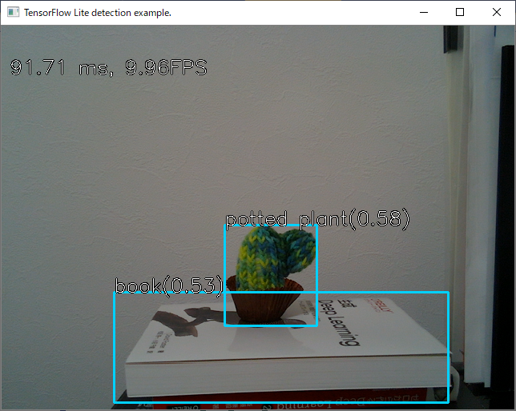
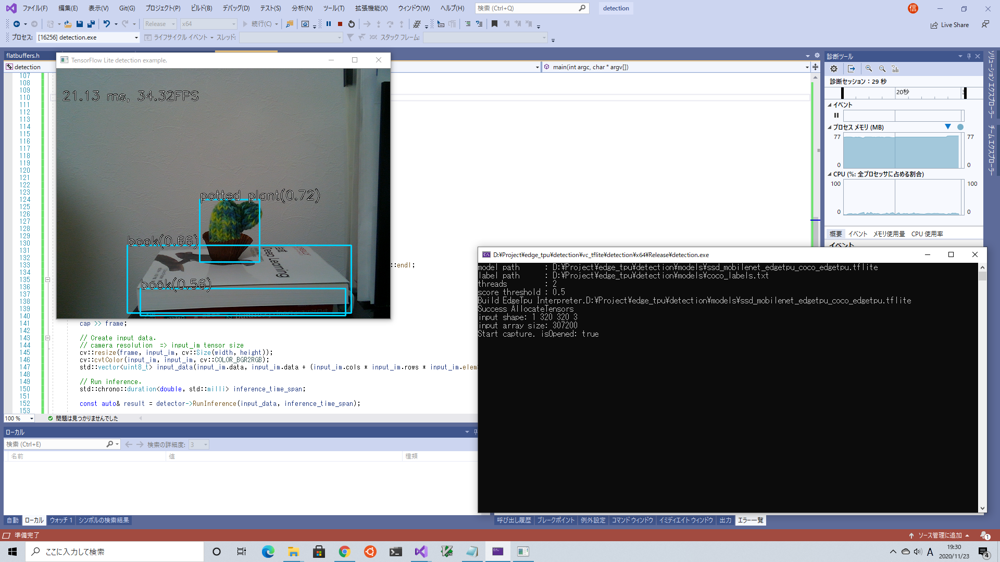

# TensorFlow Lite and TensorFlow Lite EdgeTPU delegate with Visual Studio



# Reference
- [iwatake2222/play_with_tflite](https://github.com/iwatake2222/play_with_tflite)
- [Build TensorFlow Lite with CMake](https://github.com/tensorflow/tensorflow/tree/v2.4.0-rc2/tensorflow/lite/tools/cmake)


# My environment
- Microsoft Visual Studio Community 2019 Version 16.8.2
- Bazel 3.7.1
- Anaconda3 2019.3 (Python 3.7.3 64-bit) or later 
- CMake 3.19.0

# Build TensorFlow Lite and libedgetpu
- TensorFlow Lite
- Edge TPU runtime library

## Clone repository and init submodules.
For Git Bash
```
$ git clone https://github.com/NobuoTsukamoto/edge_tpu.git
$ cd edge_tpu/detection/vc_tflite/
$ git submodule update --init
```

## Build TensorFlow Lite
- For CMake(cmake-gui), Set path and Configure.
  - Where is the source code:<br>*PATH_TO*\edge_tpu\detection\vc_tflite\tensorflow\tensorflow\lite
  - Where to build the binaries:<br>*PATH_TO*\edge_tpu\detection\vc_tflite\tensorflow\tflite_build
- Set parameters, Configure and Generate.  
  - TFLITE_ENABLE_MMAP: uncheck
  - TFLITE_ENABLE_NNAPI: uncheck
  - TFLITE_ENABLE_XNNPACK: uncheck (If checked, a build error will occur *1)
- Open Project(cmake-gui) and launch Visual Studio(tensorflow\tflite_buildtensorflow-lite.sln). 
  - Select **ALL_BUILD** project form Solution explorer and Release build.
  - After a successful build, copy the *.lib files form **Release** and **_deps** directory.<br>
  ```
  tflite_build\Release\tensorflow-lite.lib
  tflite_build\\_deps\farmhash-build\Release\farmhash.lib
  tflite_build\\_deps\fft2d-build\Release\fft2d_fftsg.lib
  tflite_build\\_deps\fft2d-build\Release\fft2d_fftsg2d.lib
  tflite_build\\_deps\flatbuffers-build\Release\flatbuffers.lib
  tflite_build\\_deps\ruy-build\Release\ruy.lib
  ```

Note:  
*1: If *TFLITE_ENABLE_XNNPACK* is checked, the following build error occurs in the pthreadpool project.
```
fatal error C1083: include Cannot open include file: 'stdatomic.h':No such file or directory
```
*2: Nothing is copied when *CMAKE_INSTALL_PREFIX* is set.

## Build libedgetpu
- 
- Download libusb-1.0.22 and extract the files to the vc_tflite folder.
  ```
    vc_tflite
      +- libedgetpu
      +- libusb-1.0.22
      +- tensorflow
  ```
- For Anaconda Powershell Prompt
  ```
  > cd Path_to\edge_tpu\detection\vc_tflite\libedgetpu
  > Set-Item Env:Path "$Env:Path;C:\Program Files (x86)\Windows Kits\10\bin\10.0.18362.0\x64;C:\Program Files (x86)\Microsoft Visual Studio\2019\Community\VC\Tools\MSVC\14.28.29333\bin\Hostx64\x64"
  > .\build.bat
  ```
  Note: Workarounds in case of Windows Python related errors.  
[Steps to fix Windows Python Configuration issue manually #724](https://github.com/google/mediapipe/issues/724#issue-622686030)
  - After a successful build, copy the * .lib and *.dll files
  ```
  vc_tflite\libedgetpu\out\throttled\x64_windows\edgetpu.dll
  vc_tflite\libedgetpu\out\throttled\x64_windows\edgetpu.dll.if.lib
  vc_tflite\libedgetpu\bazel-out\x64_windows-opt\bin\tflite\public\libusb-1.0.dll
  ```

# Create Application (VC++)
## Dependent third party libraries
- OpenCV 4.x (4.4.0)
- Boost C++ Libraries (1.73)
- TensorFlow Lite (v2.4.0-rc2)
- libedgetpu

## Project Settings
- Include Path
  - TensorFlow Lite
    ```
    vc_tflite\tensorflow
    vc_tflite\tensorflow\tflite_build\flatbuffers\include
    ```
  - libedgetpu
    ```
    vc_tflite\libedgetpu\tflite\public
    ```
- Lib files
  ```
  tensorflow-lite.lib
  flatbuffers.lib
  ruy.lib
  farmhash.lib
  fft2d_fftsg.lib
  edgetpu.dll.if.lib
  ```
- Copy the * .dll file to the *system32* or the directory containing the exe file.
  ```
  edgetpu.dll
  libusb-1.0.dll
  ```
# Usage
```
> .\detection.exe --help
Usage: detection.exe [params] input

        -?, -h, --help, --usage (value:true)
                show help command.
        -l, --label (value:.)
                path to label file.
        -n, --thread (value:2)
                num of thread to set tf-lite interpreter.
        -s, --score (value:0.5)
                score threshold.

        input
                path to tf-lite model file.
```
